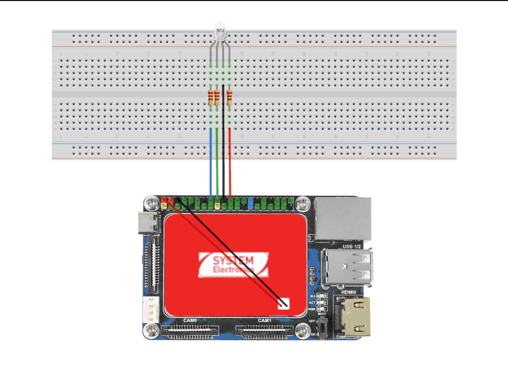
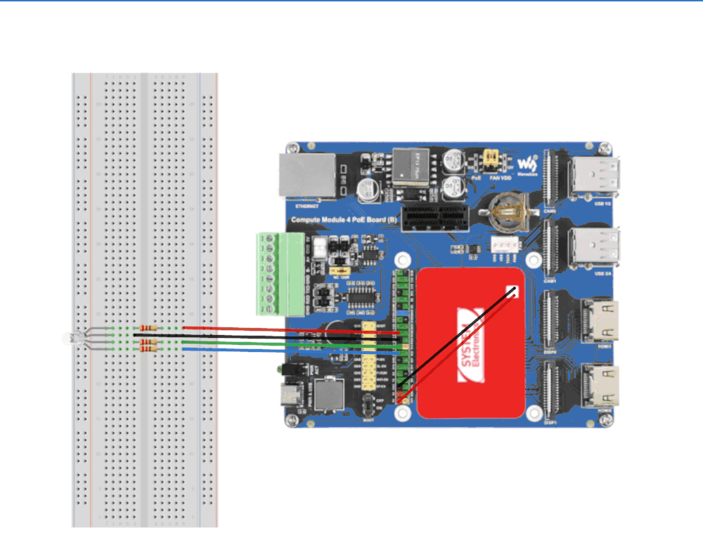

# Tutorial 02 - RGB Led Blink Waveshare
The goal of this tutorial is the reproduce the results of Tutorial 01 on three different Waveshare boards.

## Required material
* 1 x Astrial
* 1 x Waveshare CM4-IO-BASE-A
* 1 x Waveshare CM4-IO-BASE
* 1 x Waveshare CM4 PoE Board (B)
* 1 x RGB led
* 3 x 220Ω resistors
* 4 x Wire jumpers

## Setup
The hardware and software setup is the same for all the boards, since they share the same pinout.

### Hardware setup
Connect the led, resistors and jumpers as shown in the following schematic.


*CM4 Base A/B schematic*

*CM4 PoE schematic*

The Red, Green, and Blue lines of the led are connected to GPIO 25, GPIO 24, and GPIO 23 respectively, and Ground is connected to pin 20.


### Install Python packages
Install the required python packages:
```
pip3 install gpiod==2.2.0
```

### Run the Python script
Run the RGB Led Blink script:
```
python3 rgb_led_blink.py
```

## Pin Mapping
To control the GPIO pins from the Raspberry Pi 40-pin connector, follow these steps to trace the mapping:

### 1. Locate the Raspberry Pi GPIO Pin Number
Use the Raspberry Pi pinout diagram above to identify the GPIO pin number associated with your chosen physical pin on the connector. For example:

- Pin 16 on the Raspberry Pi connector corresponds to GPIO 23.
- Pin 18 corresponds to GPIO 24.
- Pin 22 corresponds to GPIO 25.

### 2. Understand the Mapping
Each GPIO on the CM4 carrier corresponds to a specific GPIO chip (gpiochipX) and line number. This mapping is determined by the DTS configuration.
Use the following table to find the associated GPIO chip and line for your desired GPIO:

| GPIO	    | gpiochip	| line
|-----------|-----------|-----
| GPIO23	| gpiochip1	| 1
| GPIO24	| gpiochip1	| 2
| GPIO25	| gpiochip1	| 3

### 3. Determine the Path to the GPIO Pin
Using the table above, trace the GPIO to its /dev/gpiochipX representation:

- GPIO 23 → /dev/gpiochip1 line 1
- GPIO 24 → /dev/gpiochip1 line 2
- GPIO 25 → /dev/gpiochip1 line 3

### 4. Drive the GPIO Pin
Once you have the gpiochip and line, you can control the pin using Python's gpiod library, as shown in the example script.

## GPIO Pins
The following table shows all the possible combinations of gpiochip and line that you can use in your code, and the corresponding GPIO, using the default DTS. 

|  GPIO  | gpiochip  | line |   | PULL-UP CM4-IO-Base-A/B | PULL-UP CM4-POE |
|--------|-----------|------|---|:-----------------------:|:---------------:|
| GPIO0  | gpiochip2 |   20 |   |               X         |        X        |
| GPIO1  | gpiochip2 |   19 |   |               X         |        X        |
| GPIO2  | gpiochip2 |   25 |   |                         |        X        |
| GPIO3  | gpiochip2 |   21 |   |                         |        X        |
| GPIO4  | gpiochip1 |    8 |   |                         |                 |
| GPIO5  | gpiochip1 |    9 |   |                         |        X        |
| GPIO6  | gpiochip3 |   27 | * |                         |                 |
| GPIO7  | gpiochip3 |   26 | * |                         |                 |
| GPIO8  | gpiochip4 |    9 | * |                         |                 |
| GPIO9  | gpiochip4 |    8 | * |                         |                 |
| GPIO10 | gpiochip4 |    7 | * |                         |                 |
| GPIO11 | gpiochip4 |    6 | * |                         |                 |
| GPIO12 | gpiochip4 |    2 |   |                         |                 |
| GPIO13 | gpiochip4 |    5 |   |                         |                 |
| GPIO16 | gpiochip3 |   24 | * |                         |                 |
| GPIO17 | gpiochip3 |   23 | * |                         |                 |
| GPIO18 | gpiochip4 |   13 | * |                         |                 |
| GPIO19 | gpiochip4 |   12 | * |                         |                 |
| GPIO20 | gpiochip4 |   11 | * |                         |                 |
| GPIO21 | gpiochip4 |   10 | * |                         |                 |
| GPIO22 | gpiochip1 |    0 |   |                         |        X        |
| GPIO23 | gpiochip1 |    1 |   |                         |                 |
| GPIO24 | gpiochip1 |    2 |   |                         |                 |
| GPIO25 | gpiochip1 |    3 |   |                         |                 |
| GPIO26 | gpiochip1 |    4 |   |                         |                 |
| GPIO27 | gpiochip1 |    5 |   |                         |                 |


\* only works with modified DTS

If you want to enable all available GPIOs, select the 'imx8mp-astrial-disable-all.dtb' device tree file in the U-Boot menu as shown [here](../README.md#select-a-dtb).