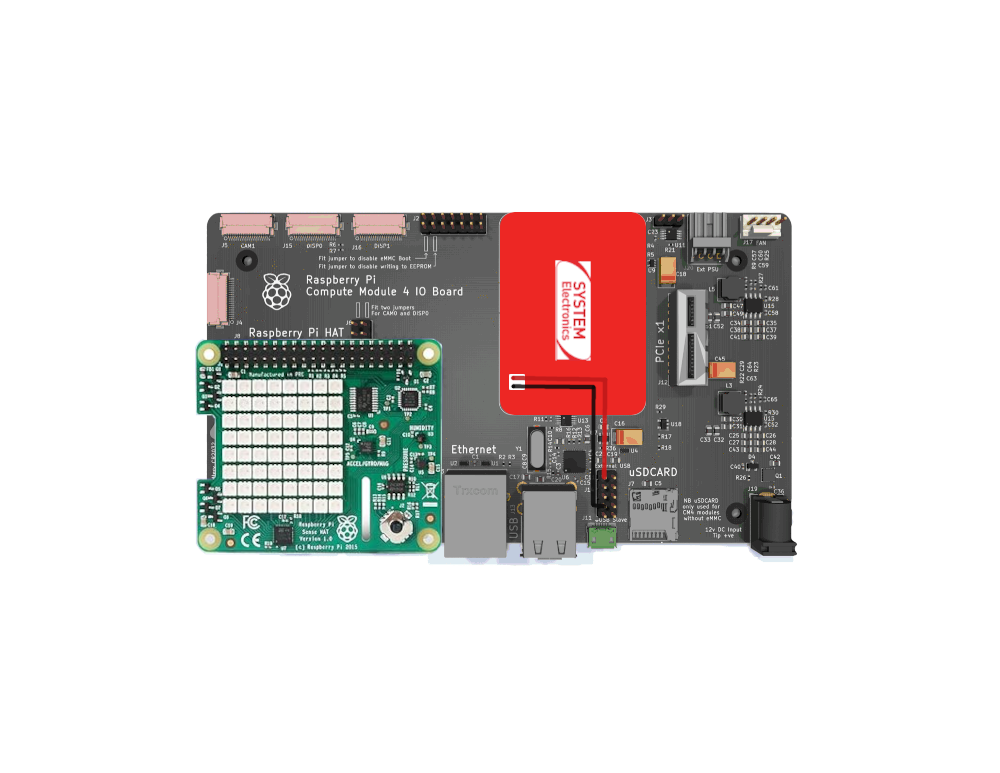
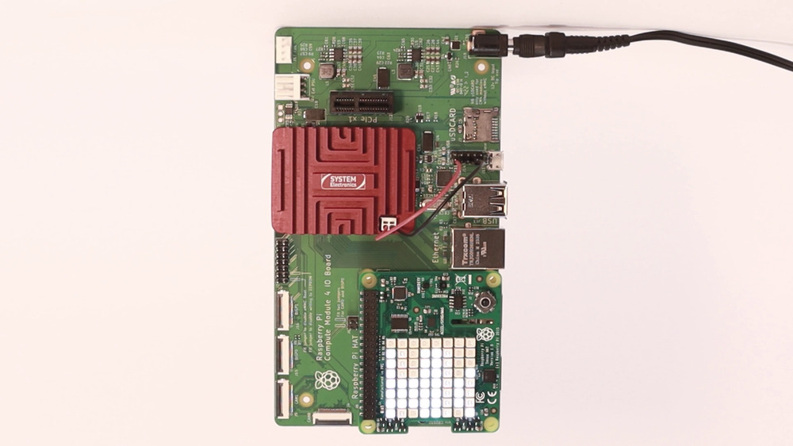

# Tutorial 03 - Sense Hat
## Material required
* 1 x Astrial
* 1 x CM4 carrier
* 1 x Sense Hat

## Setup
### Hardware setup
Connect the Sense Hat to the CM4's GPIO header, and the Astrial 5V and GND to the 5V and GND pins of the USB header, like in the following schematic.



### Use custom DTB
To enable the Sense Hat functionalities, you need to use the custom DTB provided in the `resources` folder.
For instructions on using a custom DTB, see [Use a custom DTB](./../README.md#use-a-custom-dtb).

### RTIMULib
Download and build [RTIMULib](https://github.com/RPi-Distro/RTIMULib/tree/master/Linux/python):
1. Clone the repository:
```sh
git clone https://github.com/RPi-Distro/RTIMULib.git
```
2. Copy the repository on your Astrial:
```
scp -r RTIMULib root@<ip-astrial>
```
3. Build the library:
```sh
cd RTIMULib/Linux/python
python3 setup.py build
sudo python3 setup.py install
```

### Install Python packages
Install the required Python packages:
```sh
pip3 install -r requirements.txt
```

We provide a custom version of the `sense_hat` library called `sense_hat_astrial` in the main folder of this tutorial.
Copy the `sense_hat_astrial` folder to the Astrial, together with the example scripts.

### Run the Python script
Run the example script:
```sh
python3 sense_hat_example.py
```

### Modify RTIMULib configuration
The first time you run the `imu_example` script, you may encounter an error like this:
```
OSError: Humidity Init Failed
```

This is because the default I2C bus used by the Sense Hat is 1, but the CM4 carrier uses bus 4.
To fix this, you need to modify the RTIMULib configuration file that is created automatically the first time you run the script.
Locate the `RTIMULib.ini` file inside `/home/root/.config/sense_hat`, and modify the I2CBus setting to `I2CBus=4`.


