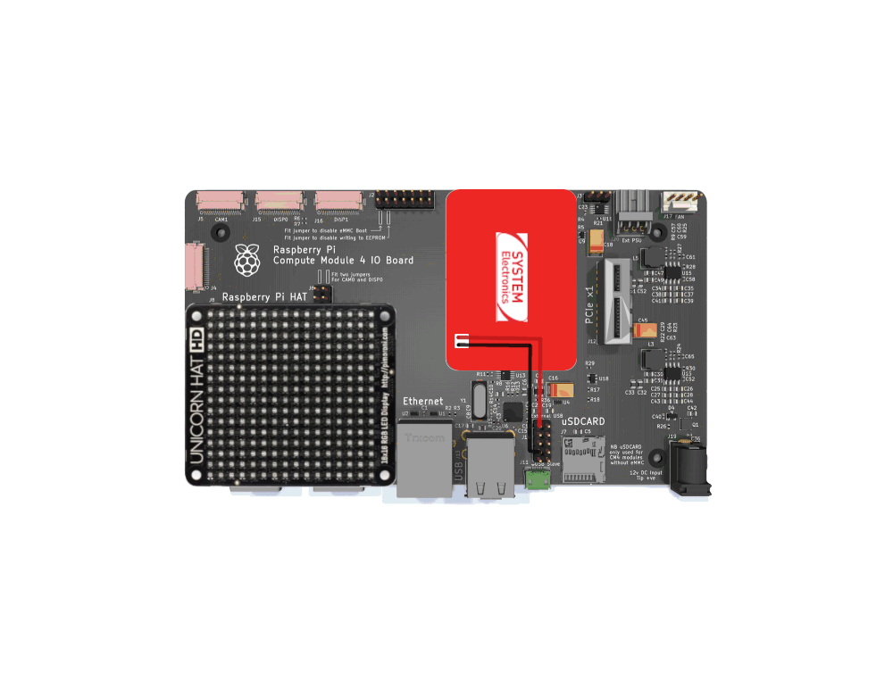
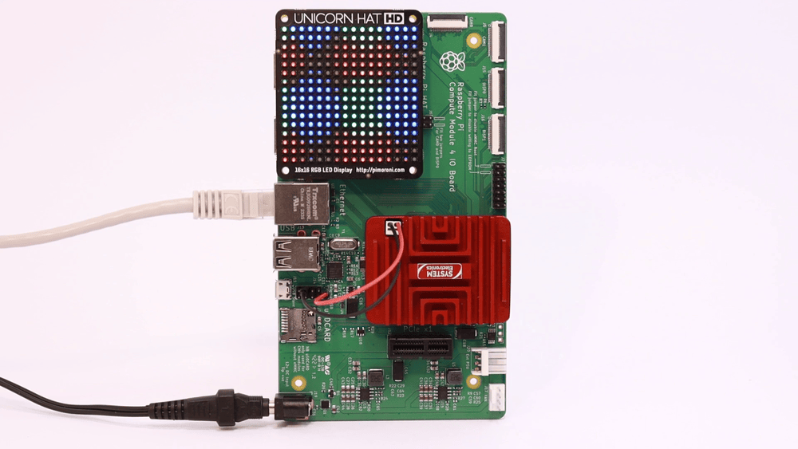

# Tutorial 04 - Unicorn Hat
## Material required
* 1 x Astrial
* 1 x CM4 carrier
* 1 x Unicorn HAT

## Setup
### Hardware setup
Connect the Unicorn Hat to the CM4's GPIO header, and the Astrial 5V and GND to the 5V and GND pins of the USB header, as shown in the following schematic.



### Install Python packages
Install the required Python package:
```
pip3 install spidev
```

We provide a custom version of the `unicornhathd` library in the main folder of this tutorial. Copy the `unicornhathd.py` file to the Astrial, together with the example script.

### Run the Python script
Run the example script:
```
python3 unicorn_hat_example.py
```



### Use the unicornhathd package (Optional) 
The provided `unicornhathd.py` script has been downloaded from the official [unicornhathd package repository](https://github.com/pimoroni/unicorn-hat-hd/tree/master), where we modifed the opened SPI bus to 1, which by default was 0. If you want to install the official python package, you can do so with:
```
pip3 install unicornhathd==0.0.4
```

and by modifying the `__init__.py` file with the correct SPI bus.