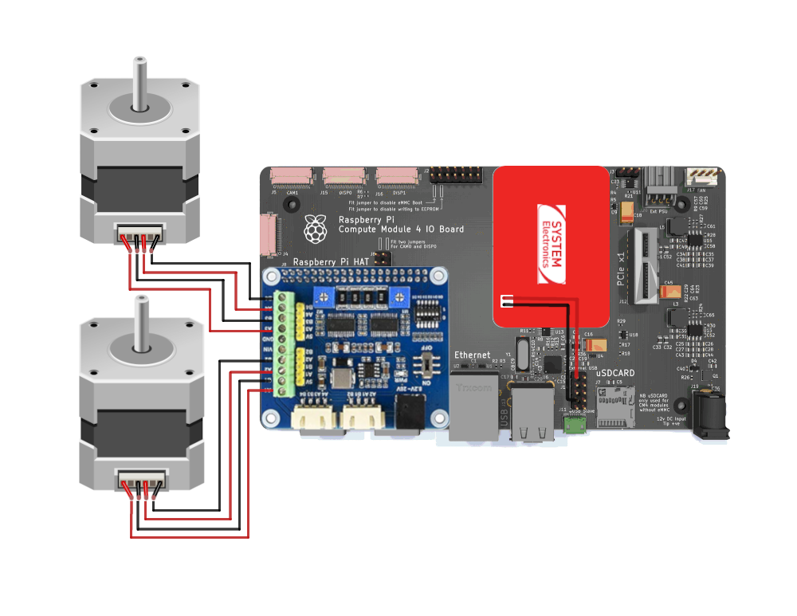
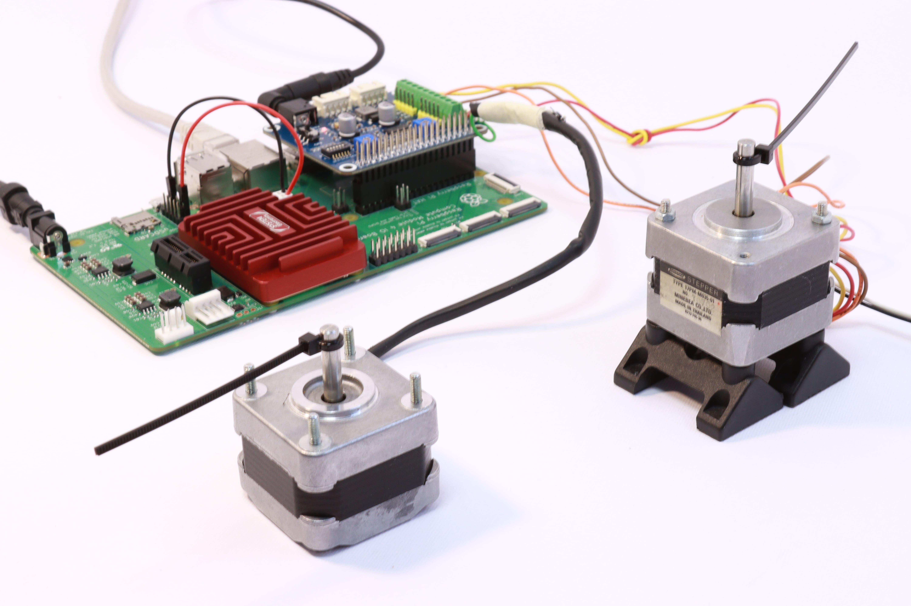

# Tutorial 06 - Stepper Motor
## Material required
* 1 x Astrial
* 2 x Stepper Motors*
* 1 x CM4 carrier
* 1 x WaveShare HRB8825 Stepper Motor HAT

\* The tutorial uses two stepper motors, but you can use only one if you want.

## Setup
### Hardware setup
Connect the Stepper Motor HAT to the CM4's GPIO header, and the stepper motors to the HAT, like in the following schematic.

Make sure to connect the stepper motors to the correct pins on the HAT. The HAT has two sets of pins for each motor, one for each coil. Connect the stepper motor M1 to the pins labeled `A1`, `A2`, `B1`, and `B2`, and the stepper motor M2 to the pins labeled `A3`, `A4`, `B3`, and `B4`.
Also, make sure to connect the power supply to the HAT, and turn it on with the switch.






### Install Python packages
Install the required Python package:
```
pip3 install gpiod==2.2.0
```

### Use the custom DTB
To enable all the GPIOs available, use the custom DTB provided in the `resources` directory (imx8mp-astrial.dtb).
For instructions on using a custom DTB, see [Use a custom DTB](./../README.md#use-a-custom-dtb).

### Run the Python script
Copy the python script of this tutorial, together with the DRV8825 library, to the Astrial:
```
scp -r stepper_example.py DRV8825.py root@<astrial_ip>:/home/root
```

Then, run the example script:

```
python3 stepper_example.py
```

You should see the stepper motors rotating in one direction, and then in the other direction.


