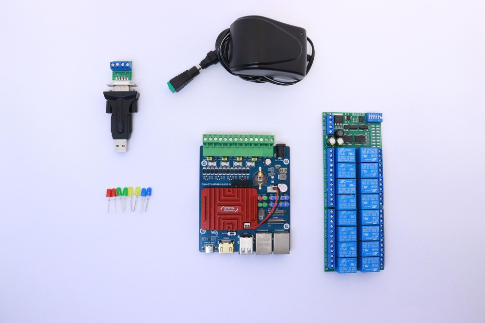
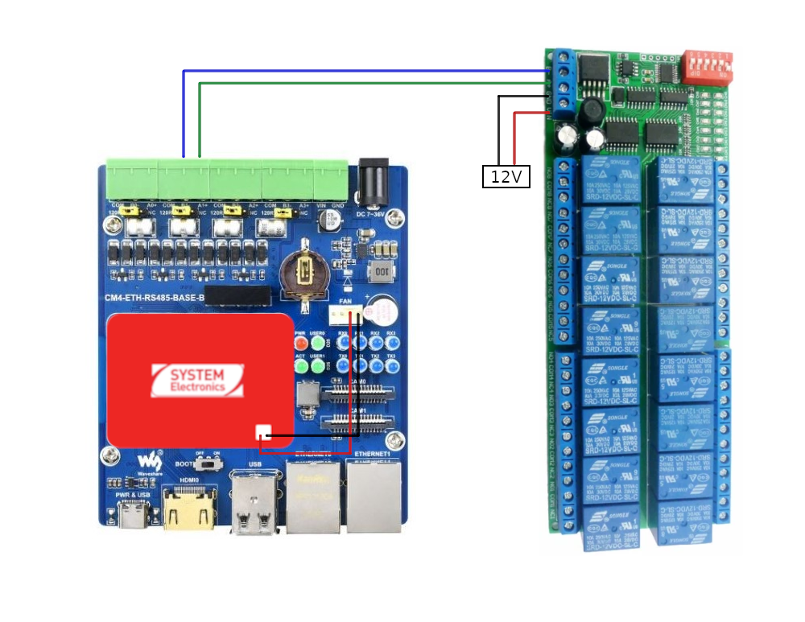
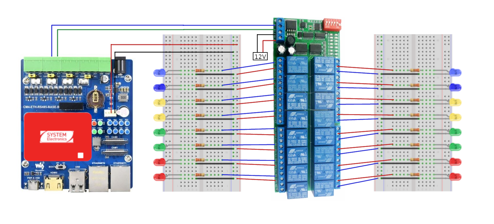

# Tutorial 08 - RS485
## Material required
* 1 x Astrial
* 1 x Waveshare CM4-ETH-RS485-BASE-B
* 1 x R421B16 relay board
* 1 x 12V power supply
* 1 x USB-RS485 adapter (optional)
* 16 x LEDs (optional)



## Setup
### Hardware setup
- Connect the Astrial to the Waveshare CM4-ETH-RS485-BASE-B using the 40-pin GPIO connector. 
- Connect the R421B16 relay board to the COM1 RS485 interface of the CM4-ETH-RS485-BASE-B. You will need to connect B1- and A1+ of the CM4-ETH-RS485-BASE-B to B- and A+ of the R421B16.
- Connect the 12V power supply to the R421B16 relay board.
- (Optional) If you need to use the AI accelerator, power the Astrial using the 5V power supply of the FAN header.




### Enable UART3
In order to use the COM1 RS485 interface, you need to enable the UART3 interface. To do this, select the 'imx8mp-astrial-uart3.dtb' device tree file in the U-Boot menu as shown [here](../README.md#select-a-dtb).

### Copy the scripts
Copy the R421B16 folder to the Astrial:
```sh
scp -r R421B16 root@<ip_address>:/home/root
```

### Install Python packages
Install the required Python packages, both on the Astrial and on the host machine:
```sh
pip3 install pyserial
```

### Run the script to control the R421B16 relay board
On the Astrial, run the script to open and close the relays:
```sh
cd R421B16/examples
python3 getting_started.py
```

### Run the script to control some LEDs
Reproduce the following schematic to control some LEDs with the R421B16 relay board:


On the Astrial, run the script to control the LEDs:
```sh
cd R421B16/examples
python3 leds_example.py
```

## Send data using the USB-RS485 adapter (Optional)
You can also use a USB-RS485 adapter to send and read data from the RS485 interface. Connect the USB-RS485 adapter to the host machine, and link it to the COM1 RS485 interface of the CM4-ETH-RS485-BASE-B.

Copy the scripts to send and receive data from the RS485 interface:
```sh
scp read_data.py root@<ip_address>:/home/root
scp send_data.py root@<ip_address>:/home/root
```

On the Astrial, run the script to read data from the RS485 interface:
```sh
python3 read_data.py --dev /dev/ttymxc2
```

On the host machine, run the script to send data to the RS485 interface:
```sh
python3 send_data.py --dev /dev/ttyUSB0
```

Note: You may need to change the device path according to the USB-RS485 adapter. On Windows, the device path is usually COMx, where x is the port number.

## Using the COM0 interface 
To correctly use the RS485 interface on COM0 (device /dev/ttymxc0), you need to disable the serial console. To do this, run the following command on the Astrial:
```sh
sudo systemctl stop serial-getty@ttymxc0.service
```