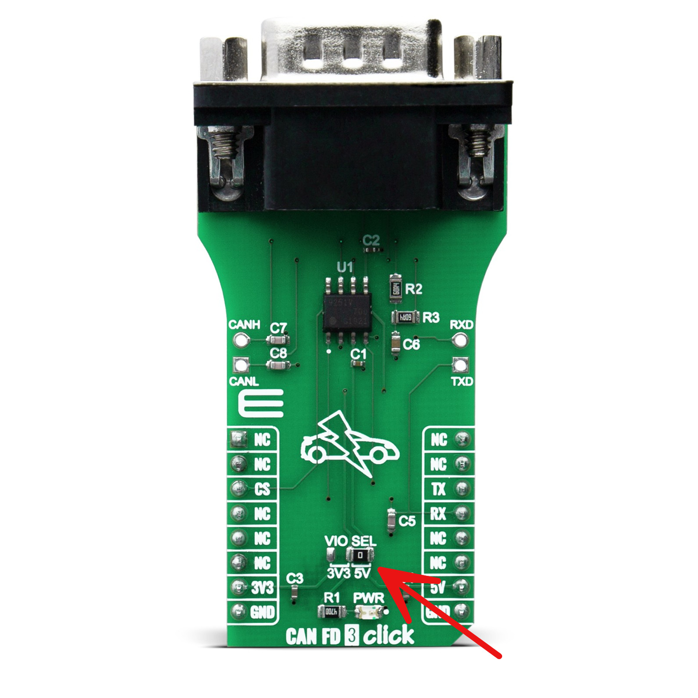
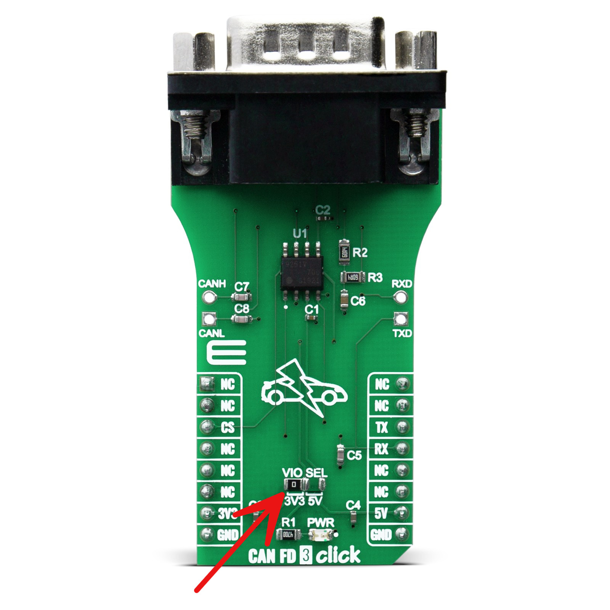
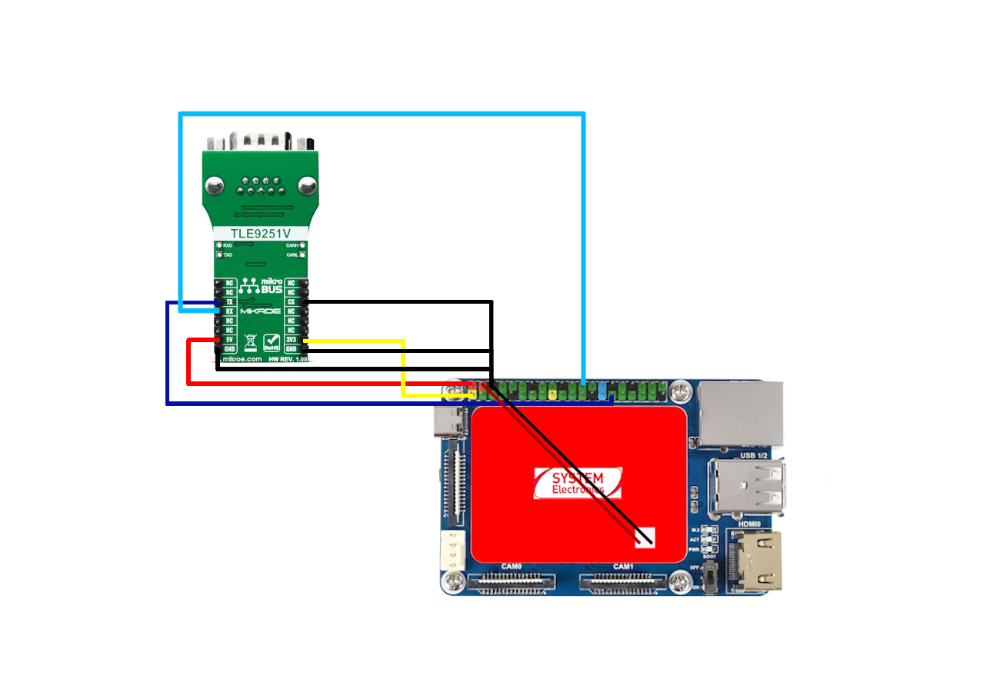

# Tutorial 09 - CAN
## Material required
* 1 x Astrial
* 1 x Raspberry Pi Compute Module 4 IO Board
* 1 x Waveshare CM4-IO-BASE-A Board
* 1 x CAN FD 3 Click
* 1 x Waveshare RS485 CAN HAT (B)
* 10 x F/F Jumper wires

## Setup
### Hardware setup
To use Astrial's integrated CAN controller you first need to **set your CAN FD 3 Click to communicate using 3.3V instead of 5V** (**if you don't do this you might damage permanently your Astrial**). To do this you will need to desolder a 0Ω resistor from the CAN FD 3 Click VIO SEL 5V and solder it on 3V3.


*Wrong VIO SEL configuration (5V)*

*Correct VIO SEL configuration (3V3)*

After doing this connect the transceiver to your Astrial using the GPIOs on the carrier as shown in the image below.



To use the CAN Hat instead you will only need to connect it to the board using the GPIO header.
When both are connected correctly connect the hat CAN port to the FD3 Click serial port.

### Python packages
Install the required package to use the CAN Hat on the Astrial on which you're going to use it with:
```sh
pip3 install spidev==3.6
```

### Software setup
#### From the CAN hat Astrial to the FD3 Click Astrial
To receive messages on Astrial's CAN controller follow these steps on the CAN hat Astrial:
* Use the default Device Tree Blob (DTB): to enable the CAN, you need to upload the default Device Tree to your Astrial board if you modified it previously. This DTB enables Astrial's CAN. You can find the custom DTB in the `resources` folder.
For instructions on using a custom DTB, see [Use a custom DTB](./../README.md#use-a-custom-dtb).
* Set up CAN: launch this command to establish CAN link with the desired bitrate (we are using 125000 but you can choose other values)
```sh
ip link set can0 up type can bitrate 125000
```
* Make the Astrial listen for messages: to be able to receive messages we are going to use a specific command which prints to terminal every received message over CAN-bus
```sh
candump can0
```
Now let's move on the other Astrial so that we can send messages to be seen on this one:
* Use the default Device Tree Blob (DTB): to enable SPI communication, you need to upload the default Device Tree to your Astrial board if you modified it previously. You can find the DTB in the resources folder of the GitHub repository for this tutorial. If you are not sure how to do this, please refer to our GitHub guide.
* Copy the custom MCP2515 library: we provide a custom version of the Adafruit's MCP2515 library in the main folder of this tutorial.
Copy the `can_lib` folder to the Astrial, together with the example scripts.
```sh
scp -r can_lib root@<ip_address>:/home/root
```
* Copy the Python script to send data: copy the Python script in this directory named can_send.py on your Astrial.
```sh
scp can_send.py root@<ip_address>:/home/root
```
* Run the Python script to send data: run the copied python script that will send the message 'hello' every second on the can-bus.
```sh
python3 can_send.py
```

You will now see the 'hello' messages appearing on the FD3 Click Astrial's terminal.

#### From the FD3 Click Astrial to the CAN hat Astrial
Let's now do the opposite, sending message from the FD3 Click Astrial to the CAN hat Astrial.

On the CAN hat Astrial:
* Copy the python script to receive data: copy the Python script in this directory named can_listen.py on your Astrial.
```sh
scp can_listen.py root@<ip_address>:/home/root
```
* Run the Python script to receive data: Run the python script on your Astrial, it will display on your terminal all the CAN messages it receives on the bus.
```sh
python3 can_listen.py
```

On the FD3 Click Astrial:
* Use the cangen command to send messages: to send messages over CAN-bus there are some terminal commands, for example cangen will start sending random messages at regular intervals on the CAN-bus and you should be able to see them on your other Astrial with the CAN hat.
```sh 
cangen can0
```

